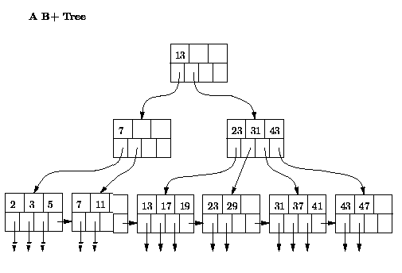

# Webエンジニアが知っておくべきデータベースの知識(妄想)

2013/11/10 @ 内定者勉強会

---

## 前置き

- Webエンジニアじゃないけど，Webエンジニアが知っておいたほうが良さそうな知識を妄想してまとめました
- 「これだけ分かってれば大丈夫」**ではないです**
  - 自分のPCの上でコリコリ動くDBの気持ちは分かるようになると思います
  - 本当はネットワーク越しにガリガリ動くDBの気持ちが分からなくちゃいけません
  - 最後の方に今後の勉強の指針なども書きました

---

## 自己紹介

- 中谷 翔 (laysakura)
- 東大情報理工M2: (分散DB,ストリーム処理)
- [Twitter](https://twitter.com/laysakura)
- [Github](https://github.com/laysakura)
- [blog: 俺とお前とlaysakura](http://laysakura.hateblo.jp)
- 日本地ビール協会公認 **ビアテイスター**

---

## 最近の活動

- IPA未踏: High Performance SQLite の開発
- 長期インターン: [MySQLite](https://github.com/laysakura/MySQLite-Storage-Engine) (MySQLストレージエンジン) 開発
  - MySQLからSQLiteのDBファイルを，SQLiteよりも高速にアクセス(開発継続中)
- PyPIモジュール: [nextversion](https://pypi.python.org/pypi/nextversion)
  - 次のバージョン番号を出す (1.0.2 -> 1.0.3)
- CPANモジュール: [Search::Fulltext](http://search.cpan.org/~laysakura/Search-Fulltext/lib/Search/Fulltext.pm), [Search::Fulltext::Tokenizer::MeCab](http://search.cpan.org/~laysakura/Search-Fulltext-Tokenizer-MeCab/lib/Search/Fulltext/Tokenizer/MeCab.pm)
  - らくちん日本語全文検索
  - [ブログ記事](http://laysakura.hateblo.jp/entry/20131011/1381477266)が177ブクマ(2013/11/02現在), はてなブログ人気エントリー入り(嬉しい)

---

## 今日やること

硬派にやります

- SQL
- インデックス
- トランザクション

---

# 導入

---

## DB(子供)からRDBMS(大人)へ

- よくDBって言われるものの正式名称: RDBMS (**Relational** Database Management Systems)
  - テーブル = リレーション
  - SQL = 関係代数演算の記述法のひとつ
  - 関係代数 = リレーションを扱う理論
- とにかく: SQL使って表を書くやつはRDBMSって呼びます!

---

## RDBMSの嬉しさ

- 楽，速い，安心
  - **SQL**でらくちんデータ検索
  - **インデックス**で高速データアクセス
  - **トランザクション**で大事なデータを保護
- (個人的には) SQL, インデックス, トランザクションを使いこなせて初めて「DB触れます〜」って言える (と思う)

---

# SQL

要点: 基本の5操作覚えれば大体書けるようになる

---

## 目標: このくらいのクエリはさらっと(書き|読み)たい

```sql
-- TPC-H Query#10
select
	c_custkey, c_name,
	sum(l_extendedprice * (1 - l_discount)) as revenue,
	c_acctbal, n_name, c_address, c_phone, c_comment
from
	customer, orders, lineitem, nation
where
	c_custkey = o_custkey
	and l_orderkey = o_orderkey
	and o_orderdate >= date ':1'
	and o_orderdate < date ':1' + interval '3' month
	and l_returnflag = 'R'
	and c_nationkey = n_nationkey
group by
	c_custkey, c_name, c_acctbal, c_phone, n_name, c_address, c_comment
order by
	revenue desc;
```

**関係代数基本の5操作**の組み合わせでしかない

---

## 関係代数基本の5操作

| 名前        | 意味       | SQL                               |
|-------------|------------|-----------------------------------|
| selection   | 行絞り込み | WHERE                             |
| projection  | 列絞り込み | (カラム名指定)                    |
| sort        | ソート     | ORDER BY                          |
| aggregation | 集約       | GROUP BY, count(\*), avg(\*), ... |
| join        | 結合       | JOIN, WHERE条件                   |

---

## selection - 行絞り込み

| id | name | age |
|----|------|-----|
|  1 | 仁志 |  25 |
|  2 | 清水 |  18 |
|  3 | 高橋 |  31 |
|  4 | 松井 |  33 |
|  5 | 清原 |  22 |
|  6 | 江藤 |  21 |
|  7 | 二岡 |  19 |
|  8 | 村田 |  63 |
|  9 | 上原 |  28 |

```sql
select * from Giants where id >= 3 and id <= 5;  -- 往年のクリーンナップ・・・
```


## selection - 行絞り込み

| id | name | age |
|----|------|-----|
|  3 | 高橋 |  31 |
|  4 | 松井 |  33 |
|  5 | 清原 |  22 |

```sql
select * from Giants where id >= 3 and id <= 5;  -- 往年のクリーンナップ・・・
```

---

## projection - 列絞り込み

| id | name | age |
|----|------|-----|
|  1 | 仁志 |  25 |
|  2 | 清水 |  18 |
|  3 | 高橋 |  31 |
|  4 | 松井 |  33 |
|  5 | 清原 |  22 |
|  6 | 江藤 |  21 |
|  7 | 二岡 |  19 |
|  8 | 村田 |  63 |
|  9 | 上原 |  28 |

```sql
select name from Giants;  -- 名前だけとる
```


## projection - 列絞り込み

| name |
|------|
| 仁志 |
| 清水 |
| 高橋 |
| 松井 |
| 清原 |
| 江藤 |
| 二岡 |
| 村田 |
| 上原 |

```sql
select name from Giants;  -- 名前だけとる
```

---

## sort - ソート

| id | name | age |
|----|------|-----|
|  1 | 仁志 |  25 |
|  2 | 清水 |  18 |
|  3 | 高橋 |  31 |
|  4 | 松井 |  33 |
|  5 | 清原 |  22 |
|  6 | 江藤 |  21 |
|  7 | 二岡 |  19 |
|  8 | 村田 |  63 |
|  9 | 上原 |  28 |

```sql
select * from Giants order by age;  -- 年齢でソート
```


## sort - ソート

| id | name | age |
|----|------|-----|
|  2 | 清水 |  18 |
|  7 | 二岡 |  19 |
|  6 | 江藤 |  21 |
|  5 | 清原 |  22 |
|  1 | 仁志 |  25 |
|  9 | 上原 |  28 |
|  3 | 高橋 |  31 |
|  4 | 松井 |  33 |
|  8 | 村田 |  63 |

```sql
select * from Giants order by age;  -- 年齢でソート
```

---

## aggregation - 集約関数

| id | name | age |
|----|------|-----|
|  1 | 仁志 |  25 |
|  2 | 清水 |  18 |
|  3 | 高橋 |  31 |
|  4 | 松井 |  33 |
|  5 | 清原 |  22 |
|  6 | 江藤 |  21 |
|  7 | 二岡 |  19 |
|  8 | 村田 |  63 |
|  9 | 上原 |  28 |

```sql
select avg(age) from Giants;  -- 平均年齢
```


## aggregation - 集約関数

```sql
select avg(age) from Giants;  -- 平均年齢
```

| avg(age)    |
|-------------|
|       28.88 |

---

## aggregation - グループ集約

```sql
select unit, avg(age) from Member group by unit;  -- ユニットごとの平均年齢
```

| id | name   | unit | age |
|----|--------|------|-----|
|  1 | まゆゆ | AKB  |  23 |
|  2 | 松井   | SKE  |  18 |
|  3 | 前田   | AKB  |  27 |


## aggregation - グループ集約

```sql
select unit, avg(age) from Member group by unit;  -- ユニットごとの平均年齢
```

| unit | age |
|------|-----|
| AKB  |  25 |
| SKE  |  18 |

---

## join - 結合

```sql
select Member.name, Fan.name, Fan.age from Member, Fan
where Fan.oshimen = Member.name; -- 各メンバーは誰に愛されているか
```

*Member*

| id | name   | unit | age |
|----|--------|------|-----|
|  1 | まゆゆ | AKB  |  23 |
|  2 | 松井   | SKE  |  18 |
|  3 | 前田   | AKB  |  27 |

*Fan*

| id | name      | oshimen |
|----|-----------|---------|
|  1 | ブヒブヒ1 | 松井    |
|  2 | ブヒブヒ2 | まゆゆ  |
|  3 | ブヒブヒ3 | 松井    |


## join - 結合

```sql
select Member.name, Fan.name, Fan.age from Member, Fan
where Fan.oshimen = Member.name; -- 各メンバーは誰に愛されているか
```

*結果*

| Member.name | Fan.name  | Fan.age |
|-------------|-----------|---------|
| 松井        | ブヒブヒ1 |      25 |
| 松井        | ブヒブヒ3 |      22 |
| まゆゆ      | ブヒブヒ2 |      38 |

---

## 再掲: TPC-Hクエリ

selection, projection, sort, aggregation, join はどこかな?

```sql
-- TPC-H Query#10
select
	c_custkey, c_name,
	sum(l_extendedprice * (1 - l_discount)) as revenue,
	c_acctbal, n_name, c_address, c_phone, c_comment
from
	customer, orders, lineitem, nation
where
	c_custkey = o_custkey
	and l_orderkey = o_orderkey
	and o_orderdate >= date ':1'
	and o_orderdate < date ':1' + interval '3' month
	and l_returnflag = 'R'
	and c_nationkey = n_nationkey
group by
	c_custkey, c_name, c_acctbal, c_phone, n_name, c_address, c_comment
order by
	revenue desc;
```

---

## 自分でSQL書けるようになろう

- [SQLZOO](http://sqlzoo.net/wiki/Main_Page)
  - クイズ形式でSQLの練習ができる．超おすすめ
  - 「欲しい結果を得るためのクエリ」は書けるようになる
  - でも，**速いクエリ**を書けるようなるのは別の話

---

## 遅いクエリ=クソクエリ
- 結果が出れば良いってもんじゃない
  - クソクエリcommitする奴=サービス運用の敵=火炙り
- どうすれば速いクエリ書けるようになる??
  - (色々大事だけど)まずは**インデックス**を使いこなそう

---

# インデックス

要点: インデックスのデータ構造と使われどころを抑えよう

---

## インデックスの恩恵

```sql
-- ゲームユーザの情報テーブル作成
create table User (
  user_id INTEGER PRIMARY KEY AUTO_INCREMENT,
  name    VARCHAR(64),
  score   INTEGER
);

-- ユーザがどんどん追加される
insert into User values ('たかし', 300);
insert into User values ('みか',   500);
...
select count(*) from User;  -- => 100万行
```

やりたい処理: scoreが高いユーザを列挙する


## インデックスの恩恵

```sql
-- インデックスなし
select id from User where score > 10000;  -- => 10秒

-- インデックスあり
create index score_idx on User(score);
select id from User where score > 10000;  -- => 1秒
```

- インデックスの有無だけで，クエリ時間がオーダ単位で変わるのもザラ
- WHY??

---

## インデックスの考え方の '基本'

インデックスを貼る = ソート済みの 'リスト' を作る

```python
# インデックスなし:
# scoreが10000より大きい要素を探す => 全探索 O(n)
scores = [300, 500, 200, 15000, 15, ..., 20000, 10, ...]

# インデックスあり = ソート済みのリスト:
# scoreが10000より大きい要素を探す => 二分探索 O(log n)
scores = [10, 15, 200, 300, 500, ..., 15000, 20000, ...]
```

---

## 老婆心

- 万が一 `O(log n)` とかの話がわからない場合
  - 今すぐアルゴリズムとデータ構造を勉強しましょう
  - 最低限を知らないで「アプリ作れればいいや」だけでは・・・

---

## インデックスのデータ構造

- 「カラムXにインデックス貼ると，カラムXのソート済みリストができるんだ!!」
  - 惜しいけど違う
  - 'リスト' 構造はオンメモリなら十分高速
  - しかし，テーブルがメモリをはみ出すくらいでかいと，インデックスもオンメモリじゃ済まない

- ディスクに置く & 「ソート済み」なデータ構造 => **B+Tree**

---

## (おまけ1)メモリとディスクの違い

*(ディスク ≒ ハードディスクの話)*

なぜリスト構造はディスクに置かれるとそのまま使えないのか?

- リストの各要素は飛び飛びのメモリ番地に配置されている
  - リスト要素を読む => 飛び飛びアクセス = **ランダムアクセス**

- ディスクはランダムアクセスめっちゃ遅い(HDDの物理的構造の話)
- ディスクにはある程度のサイズ一気に**ブロックアクセス**するのが基本
  - ブロックサイズ ≒ セクタサイズの倍数: 4KB, 16KB, 32KB, ...

---

## (おまけ2)RDBMSの高速化 ≒ ディスクアクセスの最小化

- 覚えておくべきコスト感覚(スループットベース):
  - メモリ(DRAM): **CPUの1000倍遅い**
  - ディスク(HDD): **メモリの1000倍遅い**
  - (ネットワーク: メモリと同じくらい，ただし近い将来メモリより速いはず)

**少なくとも古典的には標題が成り立つ**

---

## B+Tree

<p style="font-size: 60%">([Jeffrey D. Ullman 氏のサイト](http://infolab.stanford.edu/~ullman/dbsi/win98/hw2.html) より引用)</p>


- ノード = ディスクブロック (1ノードが1回のブロックアクセスで読まれる)


## B+Tree

<p style="font-size: 60%">([Jeffrey D. Ullman 氏のサイト](http://infolab.stanford.edu/~ullman/dbsi/win98/hw2.html) より引用)</p>


- 末端ノード: インデックスの値 => 主キーの対応
  - 左下のノードは，`2,3,5` がインデックスの値，矢印が主キーを指している


## B+Tree

<p style="font-size: 60%">([Jeffrey D. Ullman 氏のサイト](http://infolab.stanford.edu/~ullman/dbsi/win98/hw2.html) より引用)</p>


- **末端ノードのインデックス値はソートされている**
- 末端ノード同士はリンクされている


## B+Tree

<p style="font-size: 60%">([Jeffrey D. Ullman 氏のサイト](http://infolab.stanford.edu/~ullman/dbsi/win98/hw2.html) より引用)</p>


- 中間ノード: インデックスの値を探すための目印

---

## B+Tree使用例1: 一致検索


```sql
select * from User where score=29;
```

- 図: `User.score` インデックスのB+Tree
- `score=29`のレコード(の主キー)を探せ!


## B+Tree使用例1: 一致検索


```sql
select * from User where score=29;
```

(1) ルートノードからスタートし，`13`と`29`を比較 => `13`より大きいので右の子ノードへ


## B+Tree使用例1: 一致検索


```sql
select * from User where score=29;
```

(2) `23`より大きく`31`より小さいので，左から2番目の子ノードへ


## B+Tree使用例1: 一致検索


```sql
select * from User where score=29;
```

(3) `29`が見つかり，それとペアの主キーを元にレコードを取ってこれる

---

## B+Tree使用例2: 範囲検索


```sql
select * from User where score >= 29 and score <= 37;
```

(1) `29`が見つかるとこまでは先程と同様


## B+Tree使用例2: 範囲検索


```sql
select * from User where score >= 29 and score <= 37;
```

(2) `29`のあるノードにはもうインデックス値がない => 隣の末端ノードのリンクを辿る


## B+Tree使用例2: 範囲検索


```sql
select * from User where score >= 29 and score <= 37;
```

(3) `37`が見つかったところまででストップし，`29,31,37`に対応する主キーからレコードを取る

---

## インデックスの使われどころ

- 先の2例の selection のみならず...
- **sort, aggregation, joinにも使われる**
- **適切にインデックスを貼ると，様々な処理が高速化する**
  - 宿題1: `order by key`, `group by key`, `join A.key1 on B.key2` のそれぞれで，keyにインデックスがあるときとないときの速度差を見てみる
  - 宿題2: sort, aggregation, join で，インデックスがないときとあるときに利用可能なアルゴリズムを想像&調べてみる

---

## インデックスの貼りすぎに注意

- 「インデックスすごい!もう全部のカラムに貼っちゃう!!」
  - 張っ倒される

- インデックスのデメリット
  - B+Tree分のディスク容量を使う
  - `insert`は遅くなる
    - ソート済みリストにソート順を崩さず要素を追加するときのコスト: `O(log n)`
    - ただリストに要素を追加するときのコスト: `O(1)`

- インデックスを貼るカラムを判断できる => 一人前

---

# トランザクション

要点: 並列処理の '怖さ' を知ろう

---

## トランザクションとは

- 原義: 処理・仕事のひとまとまり
- 複数のクエリを '一度に' 実行するための機能がRDBMSにおけるトランザクション

---

## トランザクションが必要となる例

```sql
-- ユーザ登録リクエストをDBに反映
insert into User (name, age) values ('たかし', 29);
 
 
 
-- ユーザ数をサービス統計に反映
update Service set num_users = num_users + 1;
```


## トランザクションが必要となる例

```sql
-- ユーザ登録リクエストをDBに反映
insert into User (name, age) values ('たかし', 29);

-- ここで外から count(*) from User と Service.num_users が参照されると?
-- => count(*) from User > Service.num_users

-- ユーザ数をサービス統計に反映
update Service set num_users = num_users + 1;
```

`User`テーブルと`Service`テーブルの整合性が崩れている

---

## トランザクションで整合性を保つ

```sql
BEGIN;  -- トランザクションの開始

-- ユーザ登録リクエストをDBに反映
insert into User (name, age) values ('たかし', 29);

-- トランザクション中は，外から「この状態」は見られない!
-- (たかしユーザが追加されたことが観測できるのはCOMMIT以後)

-- ユーザ数をサービス統計に反映
update Service set num_users = num_users + 1;

COMMIT;  -- トランザクションの終了
```

---

## トランザクションのデモ1

```sql
client1> select * from User;

client2> insert into User (name, age) values ('たかし', 29);

client1> select * from User;  -- たかしくんは追加されてる

client2> BEGIN;
client2> insert into User (name, age) values ('みか', 27);

client1> select * from User;  -- みかちゃんがいない!!

client2> COMMIT;

client1> select * from User;  -- みかちゃんが見えるように
```

---

## COMMIT or  ROLLBACK !!

<p style="font-size: 60%">(これ書いてる時はハロウィンでした)</p>

- トランザクション発行(`BEGIN`)の後にやれることは2通り
  - `COMMIT`: トランザクション中の処理をDBに反映
  - `ROLLBACK`: トランザクション中の処理をなかったことに

---

## トランザクションのデモ2

```sql
client1> select * from User;

client2> insert into User (name, age) values ('たかし', 29);

client1> select * from User;  -- たかしくんは追加されてる

client2> BEGIN;
client2> insert into User (name, age) values ('みか', 27);

client1> select * from User;  -- みかちゃんがいない!!

-- ここまでデモ1と同じ

client2> ROLLBACK;

client1> select * from User;  -- みかちゃんはなかったことに・・・
```

---

## TIPS: 暗黙のトランザクション

- `insert`とか`update`とかするとき，「暗黙のトランザクション」が発行されている
  - `insert`で100byteのレコードを挿入する際，60byte目が挿入された中途半端な状態は他のクライアントから観測できない

- トランザクション貼るのは重たい処理
  - pthread触った人なら分かるかも

- 暗黙のトランザクションよりも自前トランザクションを使ったほうが速いことも

---

## 暗黙のトランザクションが遅いデモ

```perl
for (my $i = 0; $i < 100000; ++$i) {
    $dbh->do('insert into T1 values(777)');  # トランザクションが100000回 => 遅い
}

###
$dbh->do('BEGIN');
for (my $i = 0; $i < 100000; ++$i) {
    $dbh->do('insert into T2 values(777)');  # トランザクションは1回 => 速い
}
$dbh->do('COMMIT');
```

---

## トランザクションのACID性

RDBMSのトランザクションは**ACID**性を満たすのが普通

- Atomicity, Consistency, Isolation, Durability
- それぞれちゃんと説明できるようになってるのが望ましい
- [Wikipediaの記事](http://ja.wikipedia.org/wiki/ACID_%28%E3%82%B3%E3%83%B3%E3%83%94%E3%83%A5%E3%83%BC%E3%82%BF%E7%A7%91%E5%AD%A6%29)がそこそこ分かりやすい

---

# 〆

---

## 今日やったこと

- SQL(楽さ)
  - selection, projection, sort, aggregation, join
  - 複雑なクエリも怖くない

- インデックス(速さ)
  - 検索を速くする
  - B+Tree, なぜ使われるか
  - インデックス貼りすぎの弊害

- トランザクション(安心さ)
  - 整合性を保つ
  - 暗黙のトランザクション
  - ACID

---

## 今日のインプット -> アウトプット例

- (ある程度)複雑なSQLが書けるようになる
  - 例: `$dbh->do()` 3回で得ていた結果が1回で得られるように
  - DBにやれることはDBにやらせたほうが大抵速い


## 今日のインプット -> アウトプット例

- 適切にインデックスを貼れるようになる
  - 貼りすぎず，貼らなすぎず
  - ヒント: `EXPLAIN` コマンド
    - [漢(オトコ)のコンピュータ道: MySQLのEXPLAINを徹底解説!!](http://nippondanji.blogspot.jp/2009/03/mysqlexplain.html)


## 今日のインプット -> アウトプット例

- 使うべきところでトランザクションが使えるようになる
  - 例1: ユーザの登録を，`User` テーブルと `Service.num_users` カラムに同時に反映させる(整合性のためのトランザクション)
  - 例2: 大量の`insert`の前後で一つの大きなトランザクション(速さのためのトランザクション)
    - (この場合はbulk insertの方がよかったりするかも)

---

## 今日やらなかった(けど大事な)こと

今後の勉強の指針にしてください(優先度順)

↓


## 分散環境でのRDBMS利用

- レプリケーション
  - 同期レプリケーション
  - 準同期レプリケーション
  - 非同期レプリケーション
- パーティショニング
  - ハッシュパーティション
  - レンジパーティション


## プログラミング言語からのDB使用

- DBIとかJDBCとか
  - どの言語もだいたい同じインターフェイスだからDBIやればいい
- プレースホルダ
- SQLインジェクション対策
- OR-mapper
  - DBIx
  - <p style="font-size: 60%">個人的には嫌いです(パフォーマンス出んやろ)</p>


## RDBMSの性能を出し切るために

- クエリ実行計画, クエリ実行計画ツリー
- クエリ最適化


## テーブル設計

<p style="font-size: 60%">(俺も勉強しなきゃ・・・)</p>

- 正規化，非正規化
  - 大事
- ER図
  - 必要に迫られたら覚えればいい(と思う)


## RDBMS障害復旧機能

- 単ノード
  - ログを使った復旧
- 複数ノード
  - active-active 構成
  - active-slave 構成
  - バックアップとしてのレプリケーション


## 発展的なインデックス

- ハッシュインデックス
- マルチカラムインデックス
- クラスタインデックス


## 「普通」じゃないデータベース

- 列指向RDBMS
- KVS (NoSQL)
  - Redis, MongoDB
- インメモリDB

---

## オススメの勉強法

これまた優先度順番

↓


## 基礎知識を身につける

[『Webエンジニアのための データベース技術[実践]入門』](http://www.amazon.co.jp/Web%E3%82%A8%E3%83%B3%E3%82%B8%E3%83%8B%E3%82%A2%E3%81%AE%E3%81%9F%E3%82%81%E3%81%AE-%E3%83%87%E3%83%BC%E3%82%BF%E3%83%99%E3%83%BC%E3%82%B9%E6%8A%80%E8%A1%93-Software-Design-plus/dp/4774150207)

- 正に我々が読むべき良書
- 分散環境での運用方法はこの本が一番かも


## 開発中に使ってみる

- 何しろ使って覚えるのは重要
  - ただし，知識を身につけないまま「とりあえず動く」使い方だけしててもあんまり意味はない
- こういう場(ハッカソン)を利用してどんどん慣れていきましょう
- `$dbh`, `$sth` とお友達になろう


## 複雑なSQLも(書く|読む)

[SQLZOO](http://sqlzoo.net/wiki/Main_Page)

- クイズ形式でSQLの練習ができる．超おすすめ
  - ただし，インデックスやクエリ実行計画を意識した「速いクエリ」は書けるようにはならないので別途勉強が必要


## SQLあるあるを身につける

[『SQLアンチパターン』](http://www.amazon.co.jp/SQL%E3%82%A2%E3%83%B3%E3%83%81%E3%83%91%E3%82%BF%E3%83%BC%E3%83%B3-Bill-Karwin/dp/4873115892)

- 「やっちゃ駄目なこと集」だけど，「本当はこうすりゃいいよね」話も同時に掲載されていて深い勉強になる
- 結構DB使ったプログラミング歴が長くないと共感でき切れないかも・・・
  - 自分も腑に落ちたのは半分くらいでした・・・


## RDBMSの速度を最大限引き出す

インフラ屋になりたいなら必須の内容

- クエリ最適化の理論を学ぶ
  - (自分の知る限り)日本語ソースでオススメなのはない
  - [『Database Management Systems, 3rd ed.』](http://www.amazon.co.jp/Database-Management-Systems-Third-Edition-ebook/dp/B002K8Q9PA/ref=tmm_kin_title_0) の Chapter 12-15
    - *Kindle 価格: ￥13,586*
    ・・・・高すぎンゴ・・・
    - [スライド集](http://pages.cs.wisc.edu/~dbbook/openAccess/thirdEdition/slides/slides3ed.html)もあるので，(かいつまみすぎな気はするが)それを利用する手も

---

# 以上

ありがとうございました!
